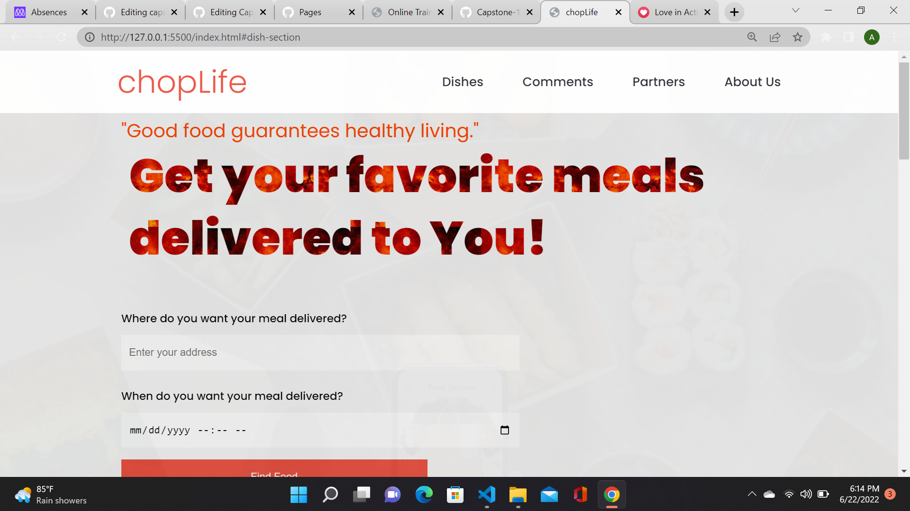
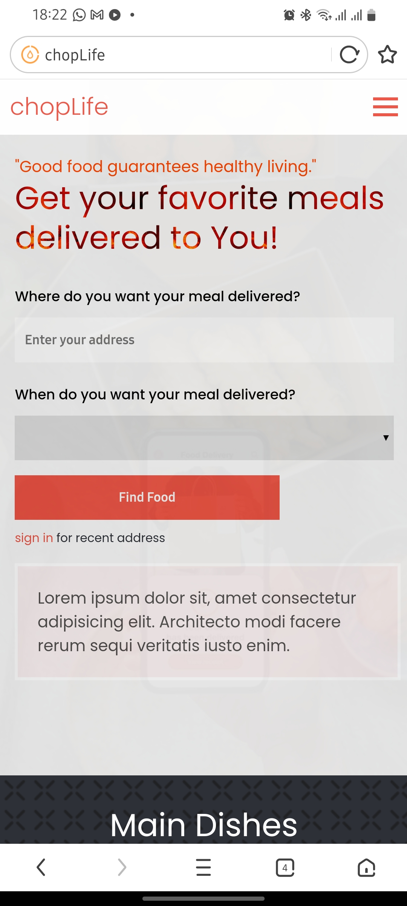
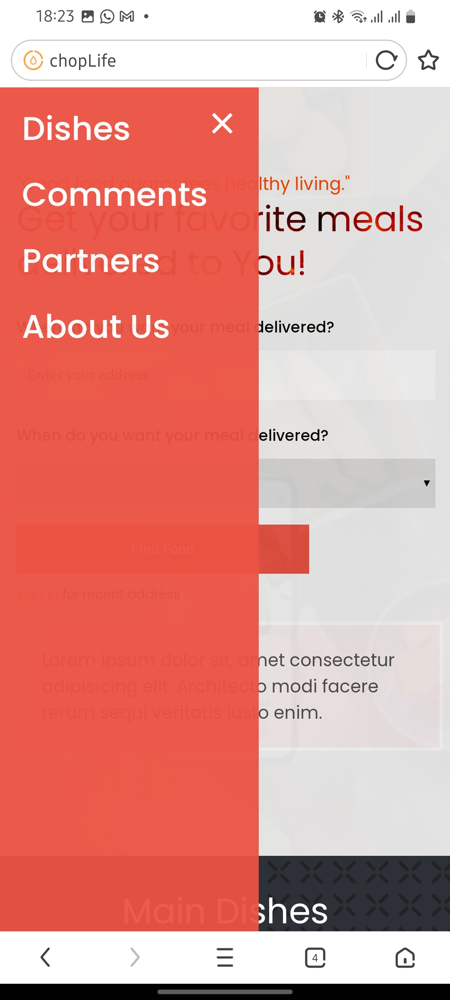

# chopLife

> chopLife is a food delivery app that connects users to their favorite restaurants. It provides a platform for users to get their favorite meals to their doorstep from their favorite restaurants, for restaurants to connect more with customers, for dispatch riders to connect more with customers.
## Screenshots

- **Desktop Home Screen**

## Built With

- Major languages: HTML, CSS and javaScript
- Frameworks: Bootstrap
- Technologies used: git-flow, webhint, lighthouse, Eslint.

## Live Demo

[Live Demo Link](https://ibizugbe.github.io/Capstone-Project-1/)

## ScreenShots

## Getting Started

**This is an example of how you may give instructions on setting up your project locally.**
**Modify this file to match your project, remove sections that don't apply. For example: delete the testing section if the currect project doesn't require testing.**

To get a local copy up and running follow these simple example steps.
- **Mobile Menu**

### Prerequisites

### Setup

### Install
## Built With

### Usage
- Major languages: HTML, CSS and javaScript
- Frameworks: Bootstrap
- Technologies used: git-flow, webhint, lighthouse, Eslint.

### Run tests
## Live Demo

### Deployment
[Visit chopLife here](https://ibizugbe.github.io/Capstone-Project-1/)

## Getting Started

- NodeJs, npm needs to be installed in system
- For local project set up, run `git clone https://github.com/Ibizugbe/Capstone-Project-1`

## Authors

To get a local copy up and running follow these simple example steps.

Contributions, issues, and feature requests are welcome!

Feel free to check the [issues page](../../issues/).
Feel free to check the [issues page](https://github.com/Ibizugbe/Capstone-Project-1/issues).

## Show your support

Give a ⭐️ if you like this project!

## Acknowledgments

- Hat tip to anyone whose code was used
- Inspiration
- etc
- [microverse](Microverse.org)
- [Cindy Shin](https://www.behance.net/adagio07)

## 📝 License
